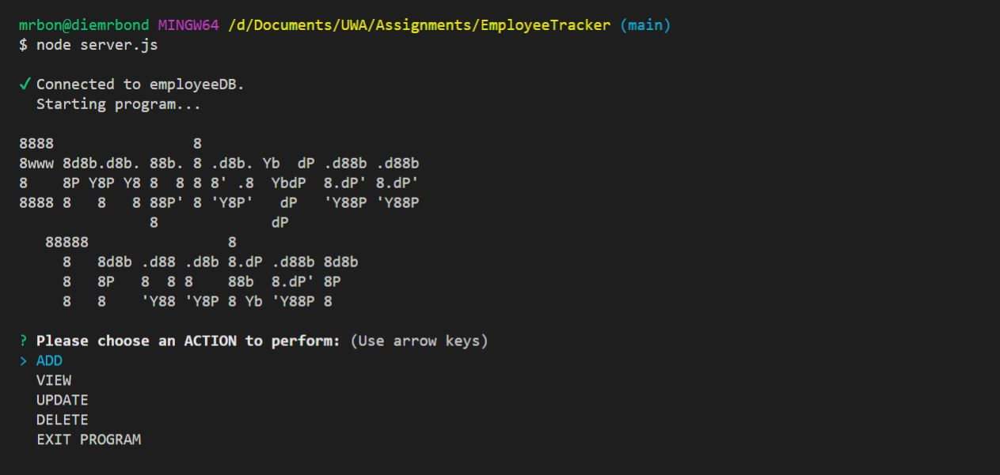

# Employee Tracker

## Description 
  For this project, we needed to create a mysql database using schema and seeds, and a CLI that allowed users to ADD, UPDATE, VIEW and DELETE the ROLES, DEPARTMENT and EMPLOYEES. 
  
  Additional functionality allows the user to VIEW EMPLOYEES by DEPARTMENT and MANAGER, view the DEPARTMENT BUDGET, confirm before DELETE. 
  
  Packages used include mysql, inquirer, console.tables.

  
  

  ---
## Demonstration Video
https://www.youtube.com/watch?v=BiVQcKUq5Y4

  ---
  ## Table of Contents

  * [Installation](#installation)
  * [Usage](#usage)
  * [Contributing](#contributing)
  * [License](#license)
  * [Questions](#questions)

  ---
  ## Installation 
  1. In git bash, run `git clone https://github.com/diemrbond/EmployeeTracker` 
  2. Run `npm install`

  
  ---
  ## Usage 
  To use this project, run `node server.js` and follow the onscreen instructions.

  
  ---
  ## Contributing 
  If you would like to contribute to this project, please send a Pull Request.

  ---
  ## License 
  This application is licensed under: GNU GPLv3
  
This program is free software: you can redistribute it and/or modify it under the terms of the GNU General Public License as published by the Free Software Foundation, either version 3 of the License, or (at your option) any later version.

This program is distributed in the hope that it will be useful, but WITHOUT ANY WARRANTY; without even the implied warranty of MERCHANTABILITY or FITNESS FOR A PARTICULAR PURPOSE. See the GNU General Public License for more details.

You should have received a copy of the GNU General Public License along with this program. If not, see <https://www.gnu.org/licenses/>.

  
  ---
  ## Questions
  If you have any questions about this project, please feel free to contact me via the following information:

  

  Andrew Kelleher

  Github: https://github.com/diemrbond

  Email: [mrbondmustdie@gmail.com](mailto:mrbondmustdie@gmail.com)

  ---
  © 2020 Andrew Kelleher | diemrbond.github.io
